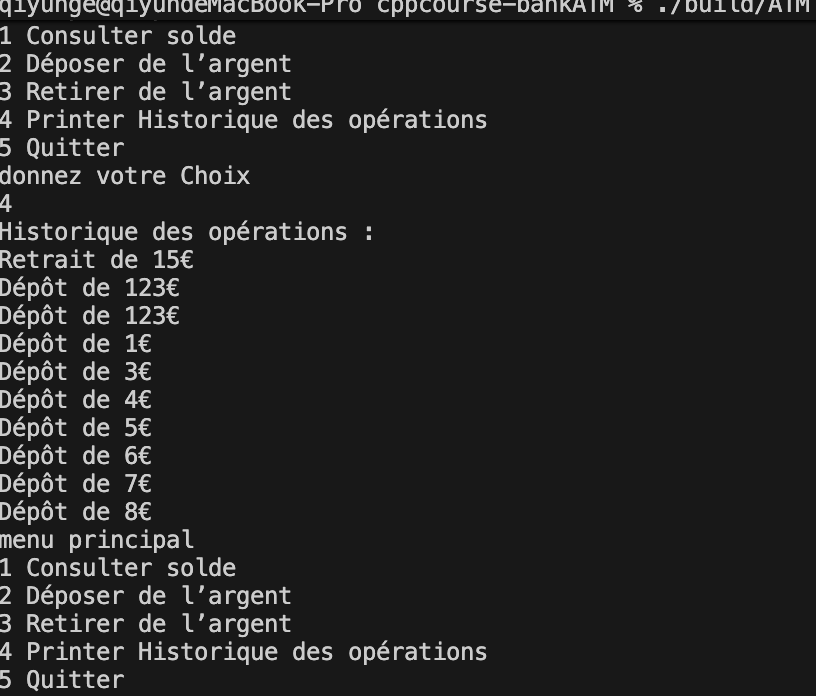

# rapport de seizième iteration

Github: [https://github.com/gqysmart/cppcourse-bankATM]( https://github.com/gqysmart/cppcourse-bankATM)

## Files

    ```hpp
    include/operation.h
    include/fileStorage.h
    ```
    ```cpp
    src/App.cpp
    src/fileStorage.cpp

## **Fonctionnalités :**

- Gestion des fichiers (fstream)
- Lecture/écriture formatée
- Gestion des erreurs d’accès aux fichiers
- Sauvegarde du solde et de l’historique en fin de session dans un fichier texte
- Chargement automatique des données au démarrage
- Messages d’erreur en cas de problème d’accès

## Algorithme

    ```cpp

    #include <fstream>
    #include <algorithm>
    #include <filesystem>
    #include <regex>
    #include <string>
    #include "operation.h"
    #include "fileStorage.h"

    using namespace std;
    namespace
    {
        void intialize_account(ofstream &ofil)
        {
            // ofil << accountName << endl; // user name
            ofil << "1234" << endl; // password
            ofil << 0.0 << endl;    // balance
            ofil << 0 << endl;      // operations count
        }
        string get_data_file_path(const string        &accountNo)
        {
            return "data/user_" + accountNo + "_data.txt";
        }
    }

        namespace ATM
        {

            bool load_user_data(const string &accountNo,Operation operationHistory[],const int maxOperations,double &balance, string &password, int &loadedOperationsCount)
            {
                const string dataFileBasePath = get_data_file_path(accountNo);
                if (filesystem::exists(dataFileBasePath) == false)
                {
                    ofstream ofil(dataFileBasePath);
                    intialize_account(ofil);
                    ofil.close();
                }
                ifstream dataFile(dataFileBasePath);

                // string name;
                dataFile >> password >> balance;
                int operationCount = 0;
                dataFile >> operationCount;
                loadedOperationsCount = min(operationCount, maxOperations);
                for (int i = 0; i < loadedOperationsCount; i++)
                {
                    Operation op;
                    int type = 0;
                    dataFile >> type >> op.amount;
                    op.type = static_cast<BankOperationsType>(type);
                    operationHistory[i] = op;
                    /* code */
                }
                return true;
            }

            bool save_user_data(const string &accountNo, const string &password, const double balance,
                                const Operation operationHistory[], const int operationCount)
            {
                const string dataFileBasePath = get_data_file_path(accountNo);
                ofstream dataFile(dataFileBasePath, ios::trunc);
                dataFile << password << endl;
                dataFile << balance << endl;
                dataFile << operationCount << endl;
                for (int i = 0; i < operationCount; i++)
                {
                    dataFile << static_cast<int>(operationHistory[i].type) << " " << operationHistory[i].amount << endl;
                }
                dataFile.close();
                return true;
            }
        } // namespace ATM
    ```

## Data

    ```txt
    1234 //password
    716 //balance
    10  //history counts
    1 15  //withdraw 15euro
    0 123 //deposit 123 euro
    0 123
    0 1
    0 3
    0 4
    0 5
    0 6
    0 7
    ```


