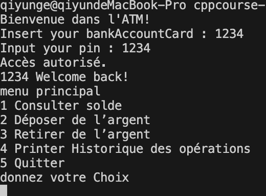
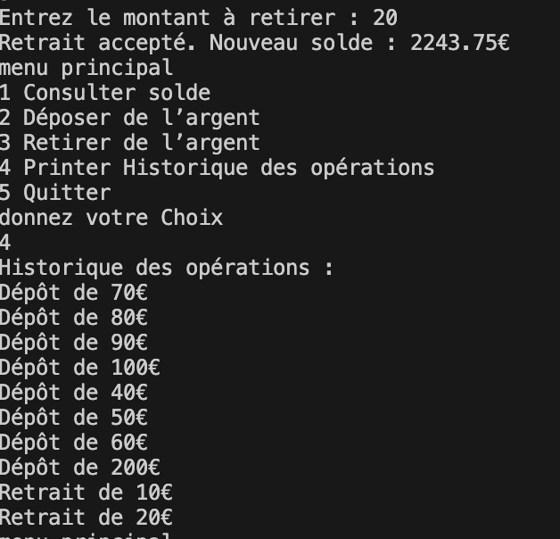

# Projet ATM – Itération 7

Cours : Programmation C++
Étudiant : Qiyun Ge et YuPing Yan
Date : Décembre 2025

## 1. Introduction

Ce document présente le fonctionnement complet de l’application Bank ATM, développée en C++.
L’objectif du projet est de simuler un distributeur automatique bancaire permettant de gérer des comptes clients, leurs soldes, et leurs opérations, tout en sauvegardant les données dans des fichiers.

Le projet utilise une structure modulaire (.h/.cpp), un stockage persistant, et une interface en ligne de commande.

## 2. Description du Fonctionnement

### 2.1 Démarrage du programme

L’application est compilée via CMake :

``` bash
cd build
cmake ..
make
./ATM
```

Au lancement, le programme charge automatiquement les fichiers de données situés dans le dossier data/.

2.2 L'ecran d'acceuil

Le menu principal propose :
(1) Login

1.1 L'utilisateur saisit un numéro de compte.(Ça simule le processus d'insertion de la carte.)

1.2 Le programme vérifie si le fichier data/user_<num>_data.txt existe.

1.3 L'utilisateur entre un mot de passe pour accéder au compte.

(1.) Création d’un nouveau compte

(1.1) L’utilisateur choisit un numéro de compte et un mot de passe avec le default "1234", le solde 0, l'operation count 0.

(1.2)e programme crée un fichier de données initialisé.


(2) Quitter

Si le client saisit un mot de passé trois fois, le programme revient à l'ecran d'acceuil.

2.3 Menu après authentification

Une fois connecté, l’utilisateur accède au menu suivant :

1. Afficher le solde
2. Dépôt d'argent
3. Retrait d'argent
4. Afficher l'historique des opérations
5. Déconnexion



***Solde***

Affiche le montant actuel enregistré dans le fichier du compte.

***Dépôt***

L’utilisateur entre un montant.

Le solde est augmenté.

Une nouvelle opération est ajoutée à l’historique.

***Retrait***

Le montant est vérifié pour éviter un solde négatif.

La transaction est validée ou refusée.

L’opération est enregistrée si réussite.

***Historique***

Liste toutes les opérations :

[1] DEPOSIT 100.00
[2] WITHDRAW 40.00
[3] DEPOSIT 300.00
...

## 3. Structures Utilisées

### 3.1 Structure pour une opération

```cpp
struct Operation {
    string type;     // "DEPOSIT" ou "WITHDRAW"
    double amount;   // Montant de l'opération
    string datetime; // Date et heure
};
```

Rôle : stocker toutes les opérations effectuées par l’utilisateur.

### 3.2 Structure pour un compte

Selon ta project structure actuelle (Operation operationHistory[] + variables séparées) :

```string password;
double balance;
int operationCount;
Operation operationHistory[MAX_OPERATIONS];
```

Rôle : représenter le compte complet d’un utilisateur.

### 3.3 Organisation des fichiers

Chaque compte est sauvegardé dans un fichier :

data/user_<num>_data.txt

Format :

```txt
    <password>
    <balance>
    <operation_count>
    <operation_type> <amount> <datetime>
    <operation_type> <amount> <datetime>
    ...
```

Exemple :

1234
560.00
3
0 100.00 2025-12-04T10:11
1 40.00 2025-12-04T11:02
0 500.00 2025-12-05T09:15

### 3.4 Modules du projet

Fichier Rôle

```txt
main.cpp Menu principal, logique utilisateur
operation.h / .cpp Structure des opérations
fileStorage.h / .cpp Lecture/écriture des fichiers
account.h / .cpp (si existant) Gestion d’un compte utilisateur
```

## 4. Exemples Concrets

4.1 Exemple de dépôt

Action :

Dépôt : 100


Affichage :

Dépôt réussi !
Nouveau solde : 100.00


Fichier mis à jour：

****
100.00
1
DEPOSIT 100.00 2025-12-05T14:20

4.3 Exemple de retrait
Retrait : 150
Solde insuffisant !

Solde reste inchangé.

4.4 Historique après plusieurs opérations

1. DEPOSIT 100.00   2025-12-05T10:20
2. WITHDRAW 40.00   2025-12-05T11:50
3. DEPOSIT 500.00   2025-12-06T09:01


## 5. Conclusion

Ce projet démontre :

l’utilisation de structures C++,

la séparation du code en modules (.h/.cpp),

la gestion d’un système de fichiers comme base de données,

un programme complet, interactif et persistant.
