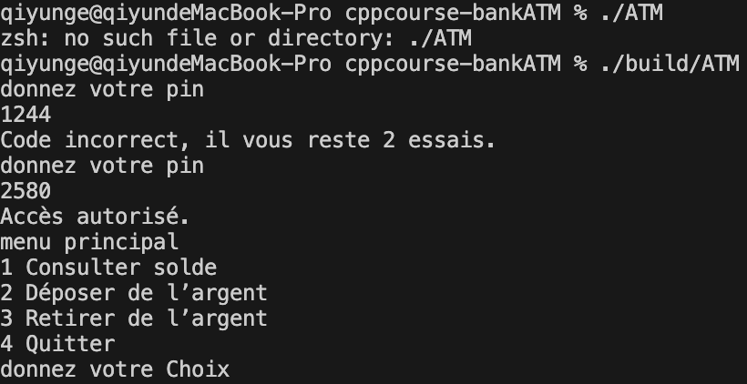

# rapport de troisième iteration

Github: [https://github.com/gqysmart/cppcourse-bankATM]( https://github.com/gqysmart/cppcourse-bankATM)

file: src/App.cpp

**Fonctionnalités :**

- Saisie d’un montant à déposer
- Vérification que le montant est supérieur à zéro
- Mise à jour du solde
- Message confirmant la transaction

*Exemple d’utilisation :*

|||
|:--:|:--:|
|pin function|le menu principale|
|||
|déposer 500|déposer -100|
